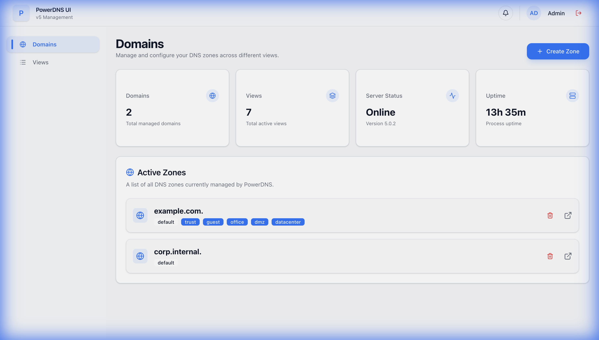
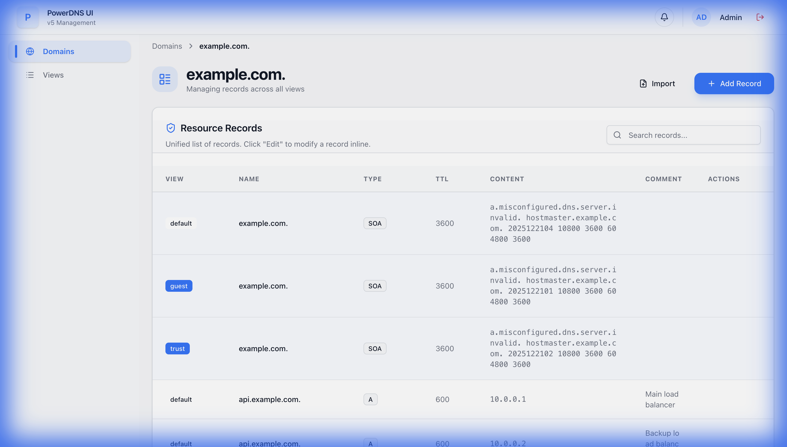

# PowerDNS UI

PowerDNS UI is a modern, fast, and feature-rich single-page application (SPA) designed for managing PowerDNS servers. Built with React, TypeScript, and Tailwind CSS, it provides a premium user experience for DNS administration, including split-horizon (Views) management and enhanced metadata support.



## Project Goals

- **Direct Interoperation**: The primary goal of this project is to interoperate directly with the PowerDNS Local API.
- **Lightweight Interaction**: All logic resides in the client side, interacting with the standard PowerDNS HTTP API.

## Non-Goals

- **No Extra Backend**: This project explicitly avoids the use of any additional backend services or databases. It relies solely on the PowerDNS API for data persistence and state management.

## Key Features

- **Domain and Zone Management**: Full CRUD operations for DNS zones with a clean, unified interface.
- **Master/Secondary Replication**: Automated primary-secondary synchronization using **PowerDNS Catalog Zones** (v5.0+).
- **Split-Horizon Support (Views)**: Robust management of PowerDNS Views, allowing different DNS responses based on the requester's network.
  
- **Intelligent Network Mapping**: Visually map CIDR networks to specific Views.
- **Batch Synchronization**: 
    - Sync network-to-view mappings from remote URLs.
    - Priority-based conflict resolution.
    - Concurrency Control: Limited concurrent API requests to ensure stability and prevent resource exhaustion.
    - Real-time Progress: Live percentage tracking for batch update operations.
- **Enhanced Record Comments**:
    - Supports individual comments for multiple records of the same type and name.
    - Advanced Metadata: Uses MessagePack binary encoding to store structured metadata (type, content, comment) within PowerDNS TYPE65534 records.
    
- **Zone File Import**: Bulk import records from BIND-style zone files using an intuitive modal with preview capabilities.
- **Sidecar Syncer (Optional)**: 
    - Configuration-driven view and network mapping management via YAML.
    - Support for fetching network lists from remote URLs.
    - Automatic cleanup of orphan views and mappings.
- **Extensive Record Support**: Support for A, AAAA, ALIAS, CAA, CNAME, DNAME, HTTPS, MX, NAPTR, NS, PTR, SOA, SPF, SRV, SSHFP, SVCB, TLSA, and TXT.
- **Modern UI and UX**:
    - Responsive design powered by Tailwind CSS.
    - Premium aesthetics with glassmorphism, smooth animations, and a polished dark-mode compatible palette.
    - Global notification system and standard modal components.

## Tech Stack

- **Framework**: React 19
- **Build Tool**: Vite
- **Language**: TypeScript
- **Styling**: Tailwind CSS 4
- **Icons**: Lucide React
- **Serialization**: MessagePack (via @msgpack/msgpack)

## Getting Started

### Prerequisites

- Node.js (v18 or later)
- npm or pnpm
- [just](https://github.com/casey/just) (optional, recommended for development)
- Docker & Docker Compose

### Fast Track (Development Environment)

This repository includes a pre-configured PowerDNS primary/secondary environment using Catalog Zones and TSIG.

1. **Prepare Environment**:
   ```bash
   cp .env.example .env
   ```

2. **Spin up and Initialize**:
   ```bash
   just dev
   ```
   This command will:
   - Start a Primary PDNS node, a Secondary node, and the UI.
   - Automatically discover container IPs and configure Catalog Zone replication.

3. **Optional Configuration Sync**:
   To start the automatic view/network syncer:
   ```bash
   docker compose --profile sync up -d
   ```

### Manual Installation

1. Clone the repository:
   ```bash
   git clone <repository-url>
   cd pdns-ui
   ```

2. Install dependencies:
   ```bash
   npm install
   ```

3. Start development server:
   ```bash
   npm run dev
   ```

## Primary/Secondary Architecture

This project implements a secure, automated master/slave replication system:

1.  **Catalog Zones**: Uses PowerDNS Catalog Zones to automatically synchronize zone additions and deletions from the Primary to the Secondary.
2.  **TSIG Security**: All AXFR (zone transfers) and NOTIFY messages are authenticated via TSIG, ensuring only authorized secondaries can pull zone data.
3.  **Automatic Orchestration**:
    -   **IP Sniffing**: The `just dev` command automatically discovers container IPs for inter-node communication.
    -   **DNS-based Discovery**: The Secondary finds the Primary via an `A` record (`ns1.<catalog-zone>`) which is dynamically updated during initialization.

### Deployment: Multi-Host (Production)

For production, you should run Primary and Secondary on separate servers.

#### 1. Primary Host
Configure `.env` for the primary node and the UI (optional sidecars).
```bash
# On Primary Host
just primary  # Start Primary + UI
just sync     # Start View Syncer (Optional)
```
*Note: Ensure port 53 (UDP/TCP) and 8081 (TCP) are accessible if your secondary is external.*

#### 2. Secondary Host
Configure `.env` with the public IP of your Primary host so the Secondary knows where to sync from.
```bash
# On Secondary Host
export PRIMARY_IP="<primary-public-ip>"
export PDNS_SECONDARY_NETWORK_MODE="host" # Bind directly to host :53

just secondary      # Start Secondary
just init-secondary # Initialize sync (TSIG + Catalog Zone)
```
*Note: The `init-secondary` command uses `docker exec` to configure the running secondary container.*

### Dynamic IP Discovery
The orchestration logic automatically sniffs container IPs and updates NS/A records in the zones. No static IP management is required in the `.env` file for standard Docker Bridge deployments.

### Sidecar Configuration
The `pdns-view-syncer` sidecar allows you to manage views and networks via `deploy/config/views.yml`.

Example configuration:
```yaml
managed_only: true # Caution: unmaps networks and drops views NOT in this file

views:
  trusted:
    priority: 100
    networks:
      - 10.0.0.0/8
  cernet:
    url: "https://china-operator-ip.yfgao.com/cernet46.txt"
```
The syncer respects priorities and handles IPv4/IPv6 CIDRs fetched from the provided URLs.

## Testing & Quality

- **Tests**: `npm test` or `just t`
- **Build**: `npm run build`
- **Clean Environment**: `just clean` or `just d`
- **Aliases**:
    - `p`: `primary`
    - `s`: `secondary`
    - `sy`: `sync`
    - `u`: `dev`
    - `d`: `down`
    - `t`: `test`
